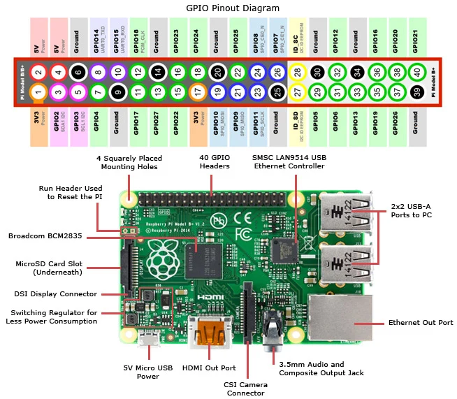

# 📘 Sensores y actuadores / Sensors & actuators

This repository contains the projects, exercises and materials developed relating to the study of sensors and actuators in a practical way

It contains the programs developed for communication with different sensors and actuators using a **Raspberry Pi**. Developed and coded using **Python** and official documentation provided by the URJC.

<div align="center">
  <a>
    
  </a>
</div>

---

## 🛠️ About development

- **Language(s) used:** [Python]
- **Tools and environments:** [Geany, GitHub, VSCode, Raspberry Pi]
- **Version control:** Git (individual private repositories for each project migrated to the current repository).
- **Reinforced skills:**
  - Electronic circuit design
  - Communication with various sensors and actuators
  - Handling of external libraries and analysis of official documentation.
  - Modelling of simple algorithmic systems
  - Basic documentation and good style practices

---

## 📂 Relevant content and structure

```bash
📁 /media/
├── /raspberry_pi_circuit_note_fig2.jpg
📁 /projects/
├── 📁 p1-introrpi-admin-mmunozs2020/
│   └── README.md
│   └── code.py
│   └── ...
├── 📁p2-led-rgb-mmunozs2020/
│   └── README.md
│   └── ledRGB.py
│   └── ledRGB_basico.py
│   └── ledRGB_mejorado.py
│   └── ...
├── 📁 p3-interrupciones-23-24-mmunozs2020/
│   └── README.md
│   └── 📁 /scripts/
│       └── interrupcionEdgeMejorado.py
│       └── interrupcionEventMejorado.py
│       └── sinInterrupcionesMejorado.py
│   └── ...
├── 📁 p4-encoder-mmunozs2020/
│   └── README.md
│   └── 📁 /scripts/
│       └── encoder.py
│   └── ...
├── 📁 p5-us-mmunozs2020/
│   └── README.md
│   └── usInstantaneo.py
│   └── 📁 /scripts/
│       └── ultrasonidos.py
│   └── ...
├── 📁 p6-reedswitch-mmunozs2020/
│   └── README.md
│   └── 📁 /scripts/
│       └── reedswitch.py
│   └── ...
├── 📁 p7-humedad-mmunozs2020/
│   └── README.md
│   └── 📁 /scripts/
│       └── humedad.py
│   └── ...
├── 📁 p8-fuerza-presencia-23-24-mmunozs2020/
│   └── README.md
│   └── 📁 /scripts/
│       └── fuerza.py
│       └── iluminacionInteligente.py
│       └── presencia.py
│   └── ...
└── 📁 p9-servo-23-24-mmunozs2020/
    └── README.md
    └── servo.py
    └── 📁 /scripts/
        └── servoMarchas.py
        └── servoVelocidades.py
    └── ...
```