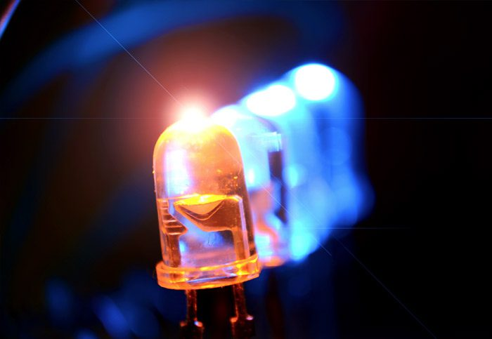
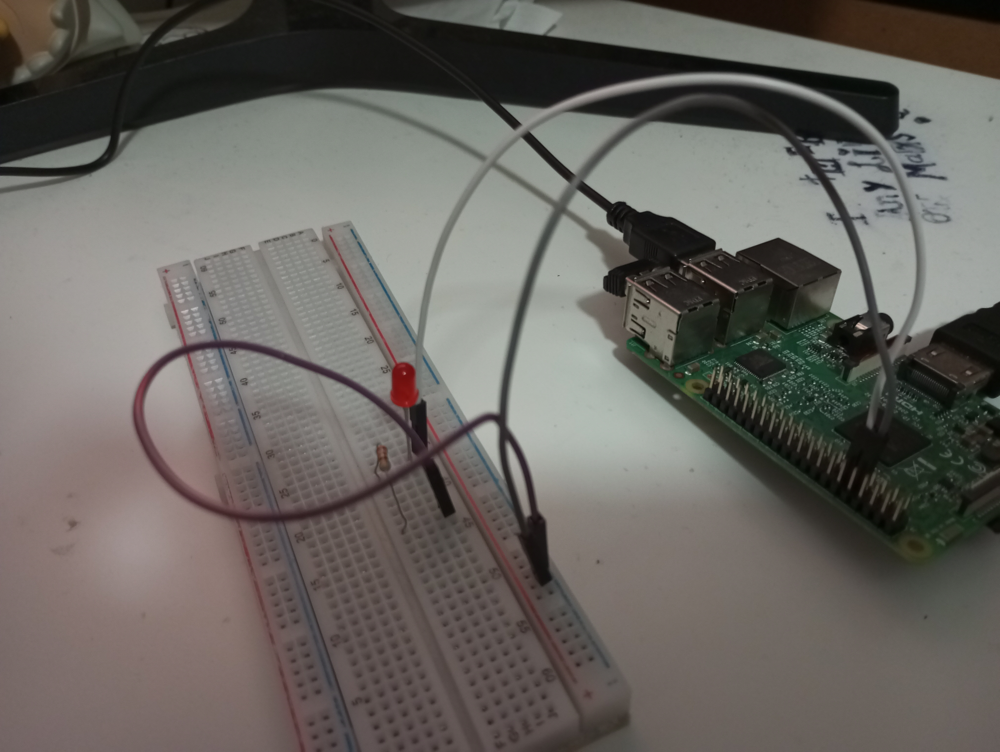

# P1-IntroRPI

<p align="center"> 
       
</p>

## Objetivo de la práctica

Los objetivos propuestos para esta práctica serían los siguientes:
- Montado de un circuito que permita el control de un led a través de la Raspberry
- Aprender las posibles formas de encendido y apagado básico del led
- Regulación de la intensidad del brillo utilizando la técnica de PWM

---

## Material empleado

- 1 Raspberry Pi 3B+
- 1 Cable Dupont macho-macho
- 2 Cables Dupont macho-hembra
- 1 Diodo rojo LED
- 1 Resistencia

### **CIRCUITO:**

<p align="center"> 
       
</p>

---

## Código y pruebas realizadas

### **Encendido y apagado simple**

Para la primera parte de la práctica, consistente en realizar el encendido y apagado de un led utilizando la Raspberry Pi, he probado dos métodos diferentes:
- Mediante **código de python**, al igual que la siguiente parte de esta misma práctica
- Empleando órdenes dadas a la propia raspberry por **comandos**, desde una terminal

De ambas maneras podíamos observar el mismo funcionamiento. Usando un programa de python sencillo, configurabamos el puerto GPIO y encendíamos el led al comenzar, y tras pulsarse cualquier tecla, el led se apagaba y el programa finalizaba.
Por otro lado, utilizando comandos, simplemente teníamos que: 
- Partiendo de una configuración GPIO base (no habiendo lanzado previamente el programa que cambiaba la configuración inicial, o limpiando la misma) crear un fichero correspondiente al puerto que emplearíamos e indicar que sería de salida, con los siguientes comandos:
```
echo 17 > /sys/class/gpio/export
echo out > /sys/class/gpio/gpio17/direction
```
- Una vez hecho esto, solo tendríamos que utilizar uno de los dos siguientes comandos para encender (1) o apagar (0) el led, respectivamente:
```
echo 1 > /sys/class/gpio/gpio17/value
echo 0 > /sys/class/gpio/gpio17/value
```
Aquí está el vídeo con el funcionamiento correspondiente al encendido:

<div align="center">
</a>
</div>

### **Modulación del brillo por ancho de pulsos**

PWM es una tecnica que permite regular el brillo de un led regulando el ancho de pulso de la corriente eléctrica que recibe. A pulsos más anchos, el brillo será mayor, mientras que frente a pulsos menores se reducirá. Esta técnica nos permite variar la intensidad luminosa del led pese a tener únicamente una conexión digital con el mismo.

Modificando el programa utilizado para el encendido previo obtenemos el funcionamiento esperado. El fichero [code.py](code.py) contiene las instrucciones necesarias para que el led se encienda primero al 100% de su capacidad luminosa, en siguiente lugar al 50%, después únicamente al 1% y finalmente se apague.

A continuación se encuentra el vídeo con el funcionamiento correspondiente a la modulación del brillo por PWM:

<div align="center">
</a>
</div>

Ambos vídeos mostrados se encuentran disponibles también en formato mp4 para su mejor visualización en [media](media/)

---

## Autoría

Práctica llevada a cabo por el estudiante:

* **Moisés Muñoz Suárez** - [mmunozs2020](https://github.com/mmunozs2020)

---