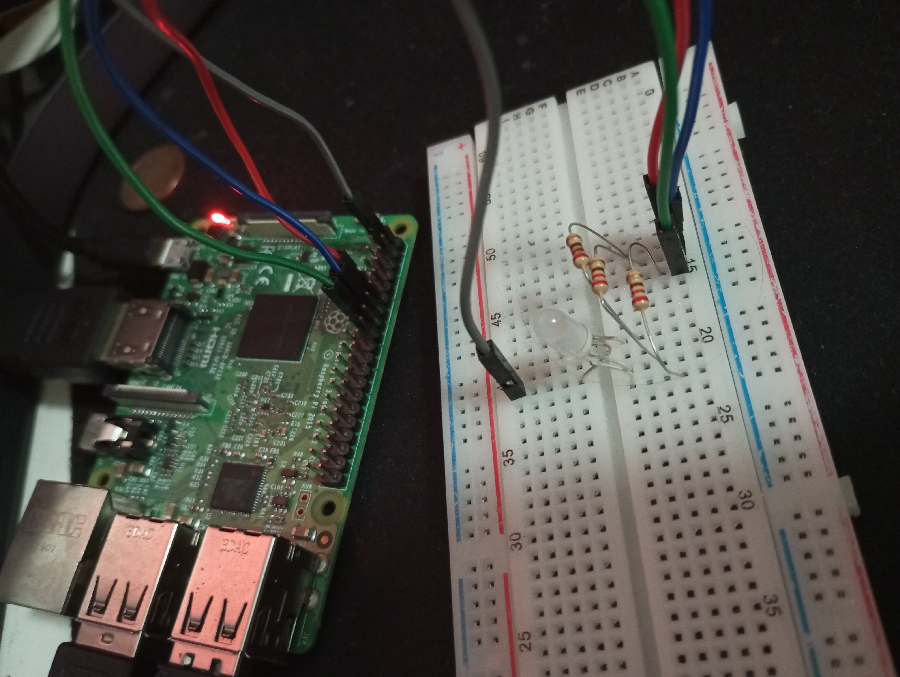
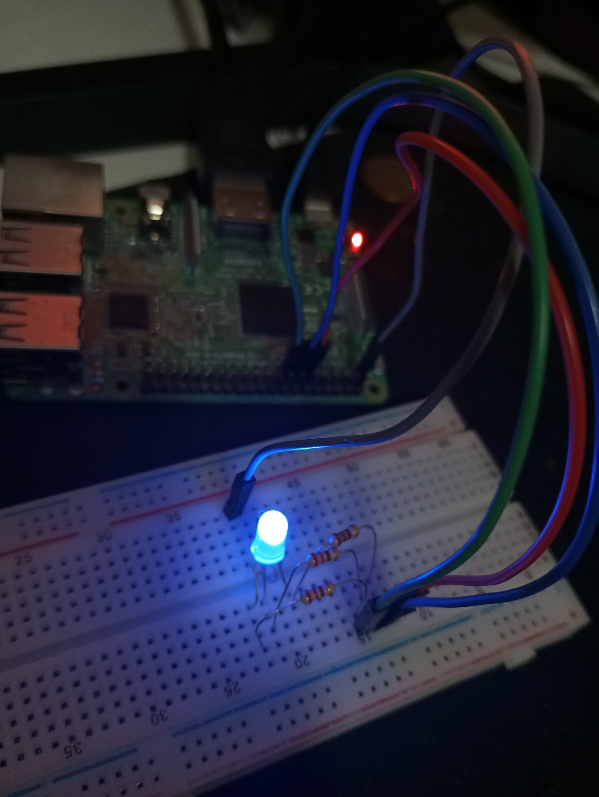

# P2-LedRGB

<p align="center"> 
       
</p>

## Objetivo de la práctica

Los objetivos propuestos para esta práctica serían los siguientes:
- Montado de un circuito que permita el control de un led RGB a través de la Raspberry
- Modificar el programa [ledRGB.py](ledRGB.py) proporcionado para encender los tres colores primarios de froma separada
- Implementar como nueva funcionalidad en otro fichero la capacidad de encender al menos 5 colores más
- Añadir una interfaz de usuario al funcionamiento de esta segunda modificación

---

## Material empleado

- 1 Raspberry Pi 3B+
- 4 Cables Dupont macho-hembra
- 1 Diodo LED RGB
- 3 Resistencias (de 220 Ohmios)

### **CIRCUITO:**

<p align="center"> 
    
    
</p>

---

## Código y pruebas realizadas

### **Encendido y apagado de los colores primarios**

Para este primer ejercicio de la práctica, he realizado diversas modificaciones en el programa proporcionado, siendo las más destacables las siguientes:
- Dado que la polaridad del led se encontraba **invertida**, la funcion encender pasó a tener como función establecer la salida como LOW, así como la función de apagar pasó a establecer el output a HIGH
- La configuración general de los puertos GPIO pasó a hacerse de forma única al iniciar el programa. Ahora las funciones afectantes al encendido y apagado únicamente se encargarán de cambiar el estado de la salida (LOW o HIGH como se ha mencionado previamente)
- He creado una breve interfaz de usuario para llamar a la función de encender con el color correspondiente según aquello que indique el usuario
- He declarado un diccionario llamado **lista_colores** que contiene la traducción de las posibles entradas a los colores que deberán ser encendidos o apagados

Al ejecutar el programa con python 

```
$> python 3 ledRGB_basico.py
```

Podemos observar que aparece una **cadena de texto**, y no ocurre nada con el led hasta que introducimos un número válido:

```
Por favor, ingrese un color válido para el LED:
[1: rojo		2: azul		3: verde	0: salir]
- _
```

Los tres primeros números, como podemos ver en el vídeo, encienden los colores primarios correspondientes indicados, y hacen que posteriormente el programa permanezca a la espera hasta recibir cualquier otra entrada por parte del usuario (pulsar cualquier tecla y/o INTRO)

<div align="center">
</a>
</div>

Para terminar el programa, bastaría con introducir el número 0 como entrada

### **Funcionalidad adicional: añadiendo colores e interfaz de usuario**

Al igual que se utilizó en la primera práctica de la asignatura, la técnica de modulación por ancho de pulsos, o modulación PWM también nos es útil ahora. Para añadir otros colores además de aquellos primarios, he realizado otras tantas modificaciones al segundo programa, llamando a este último código [ledRGB_mejorado.py](ledRGB_mejorado.py). Dichas **modificaciones** son:
- Configuración de la GPIO actualizada para poder emplear modulación PWM en las tres patillas de entrada del led
- Cambio realizado en el diccionario de colores, pasando a una traducción de strings de colores a códigos numéricos cifrados como (R, G, B), tal que cada uno de estos campos contiene un valor del 1 al 100. Aquí podemos observar el diccionario que he descrito en el código, con los colores primarios y otros 5 añadidos tras estos mismos:
```
lista_colores = {
	"rojo": (100, 0, 0),
	"azul": (0, 0, 100),
	"verde": (0, 100, 0),
	"amarillo": (100, 100, 0),
	"naranja": (100, 50, 0),
	"magenta": (100, 0, 100),
	"cian": (0, 100, 100),
	"morado": (50, 0, 50)
}
```
- Modificadas las funciones de encendido y apagado para limitar las interferencias de encender un color, y posteriormente otro a aquello deseado: la mezcla básica de colores. Esto es que, en caso de haber encendido el led en color verde y pedir ahora un encendido en rojo, se conserve el previo y el led pase a color amarillo. Los apagados funcionan de la misma manera.
- Cambios en la interfaz de usuario para adaptar las órdenes que se puedan introducir

Finalmente, el **mensaje que recibiría el usuario** al ejecutar el código sería el siguiente:
```
Por favor, ingrese una orden válida para el LED:
[encender + color | apagar + color | terminar]
- _
```

Al introducir una orden de encendido o apagado válida para el diccionario anteriormenete mencionado, se ejecutaría la acción correspondiente, tal como podemos observar con varios ejemplos encadenados **en el siguiente vídeo**:

> [VÍDEO LED RGB MEJORADO](https://youtube.com/shorts/wd-0j00ivRA)

Además del vídeo anterior, también podemos encontrar el correspondiente al GIF que muestra la funcionalidad básica en el siguiente enlace:

> [VÍDEO LED RGB BÁSICO](https://youtube.com/shorts/jNZsOTnCilg)

Para cualquier otra referencia audiovisual utilizada en este documento, consultar la carpeta [media](media/)

---

## Autoría

Práctica llevada a cabo por el estudiante:

* **Moisés Muñoz Suárez** - [mmunozs2020](https://github.com/mmunozs2020)

---