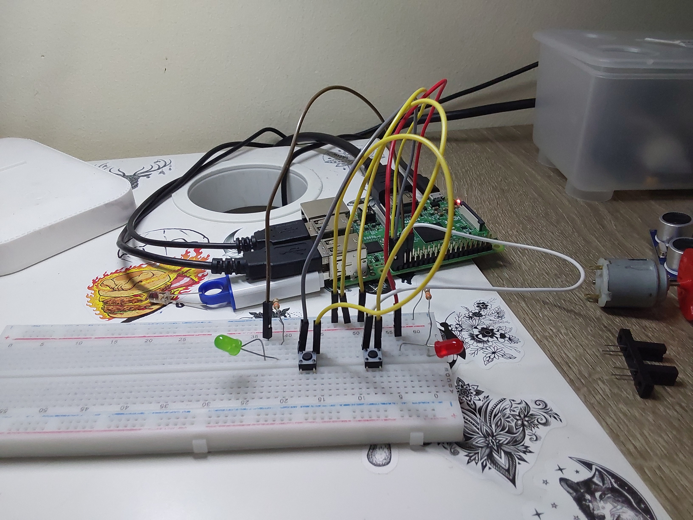
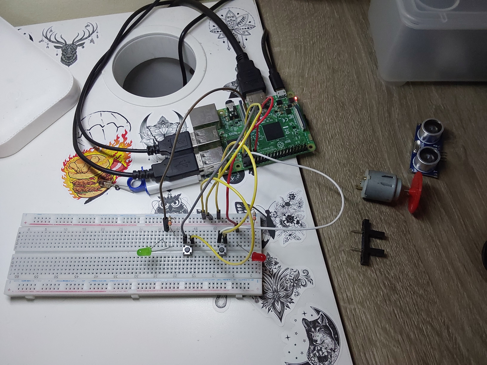

# P3-Interrupciones_23-24

## Objetivos de la práctica

Los objetivos propuestos para esta práctica serían los siguientes:
- Rediseñar el esquema de conexión, ası́ como la implementación de los tres códigos facilitados para dar soporte a dos botones que a su vez operen sobre dos LEDs de forma independiente. 
- Al pulsar uno de los botones, se encenderá un LED rojo (y se apagará al soltar dicho botón); y, al pulsar el otro botón, lo mismo pero con el otro LED, que será verde
- Ofrecer esa funcionalidad bajo las tres implementaciones que se han expuesto en el documento [practica.pdf](practica.pdf)

## Circuito
### Imagen del Circuito
<p align="center">
  
  
</p>

Se han empleado los siguientes elementos en el desarrollo y conexión del circuito:
- 1 led verde
- 1 led rojo
- 2 resistencias de 330 ohmios
- 2 botones

## Código Desarrollado

### **[sinInterrupcionesMejorado](scripts/sinInterrupcionesMejorado.py)**

El código de este programa comprueba de forma constante el estado de los botones que controlan cada led, de forma secuencial siendo el verde el primero. El control en ambos casos es idéntico y se basa en la utilización de una doble comprobación que evita los problemas de rebote al pulsar o levantar el botón. Dicha comprobación es realizada por una variable global para cada led, *v_pulsado* y *r_pulsado* respectivamente. 

Podemos ver en detalle el código encargado del control descrito anteriormente, por ejemplo, en el siguiente tramo, encargado del led verde:

```python
# - control del botón que enciende el led verde:
if (not GPIO.input(PIN_BOTON_V)) and (not v_pulsado):
    v_pulsado = True
    pwm_v.start(100)
    print("[INFO]: led verde encendido")
    time.sleep(0.25)
    pwm_v.stop()
else:
    # si el botón se ha dejado de pulsar, actualizamos la
    # variable de doble comprobación (en este caso v_pulsado)
    if not GPIO.input(PIN_BOTON_V): v_pulsado = False
```

### **[interrupcionEdgeMejorado](scripts/interrupcionEdgeMejorado.py)**

El programa proporcionado en comienzo presentaba dos problemas corregidos en esta nueva implementación: un efecto rebote en pulsaciones que ocurría de manera ocasional, y la imposibilidad de parar dicho programa con **CTRL+C**. Dichos errores fueron corregidos en la estructura principal del programa, resultando en un control secuencial de cada led con un control antirrebote, similar a la solución anterior pero con distintos métodos empleados para llegar a la solución, siendo en este caso, interrupciones *wait for edge*.

Podemos ver el control de un led ejemplificado, para ser fácil de comparar con el código previo, con el tramo encargado del led verde:
```python
# - control del botón que enciende el led verde:
if not GPIO.input(PIN_BOTON_V):
    pwm_v.start(100)
    print("[INFO]: led verde encendido")
    GPIO.wait_for_edge(PIN_BOTON_V, GPIO.RISING)
    pwm_v.stop()
```

### **[interrupcionEventMejorado](scripts/interrupcionEventMejorado.py)**

En el caso de este código, la mejora fue aún más sencilla de introducir partiendo del programa que se nos proporcionaba. El control por callbacks hizo que únicamente fuera necesario añadir dos detecciones de eventos al programa en la parte principal, que controlasen cada una un callback para un led concreto. De nuevo, manteniendo la división del programa en dos controles separados el uno del otro

En este caso, el control del led verde aparece separado, ya que por una parte tendríamos el callback que ejecuta el código para encender el led en caso de detectarse el evento declarado, y por otro lado dicha *detección de evento* añadida en la parte principal:
```python
def callbackBotonVerde(canal):
    print("[INFO]: led verde encendido")
    pwm_v.start(100)
    time.sleep(0.25)
    pwm_v.stop()
```
```python
# - control del botón que enciende el led verde:
GPIO.add_event_detect(PIN_BOTON_V, GPIO.FALLING, 
    callback=callbackBotonVerde, bouncetime=500) # expresado en ms.
```

## Solución Final

A continuacion queda un video de cada solución previa explicada en funcionamiento

> [sinInterrupcionesMejorado](https://drive.google.com/file/d/1IjYhG2Mbx7SshqMK2QxsTFb30Lqc_3q9/view?usp=drive_link)

> [interrupcionEdgeMejorado](https://drive.google.com/file/d/1IrqS2xKzGieBiGNN8SWamFZi0Zh72Yd5/view?usp=sharing)

> [interrupcionEventMejorado](https://drive.google.com/file/d/1IsA4u5wzJ4W7YKLoVHsBN0r09U4zfCl_/view?usp=sharing)

## Autoría

Práctica llevada a cabo por el estudiante:

* **Moisés Muñoz Suárez** - [mmunozs2020](https://github.com/mmunozs2020)

---
