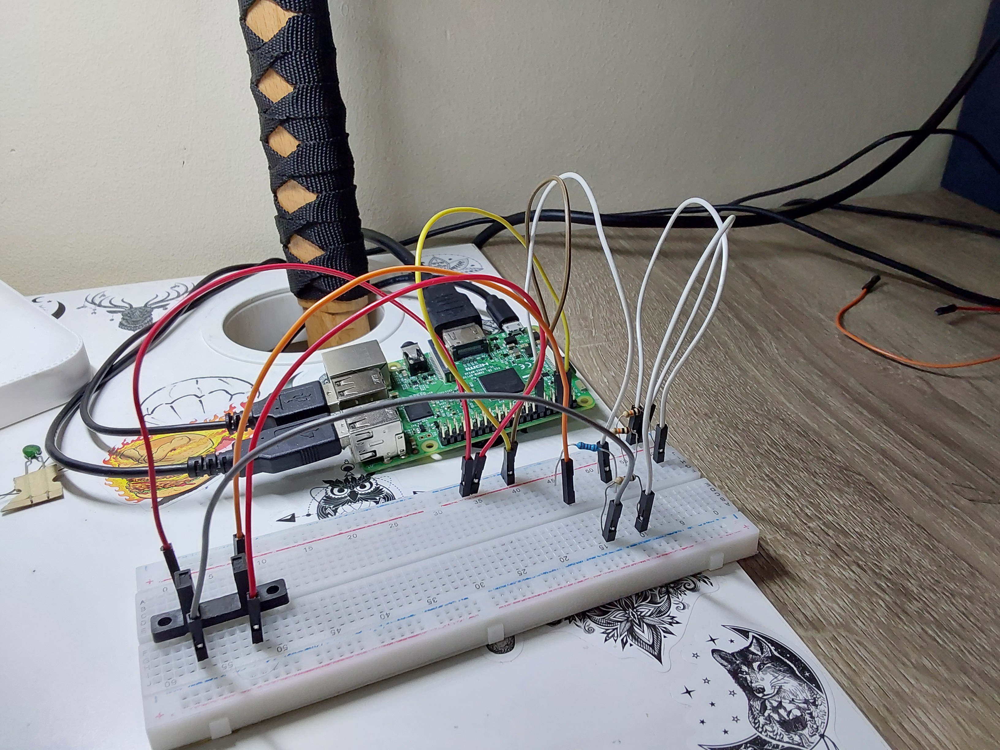
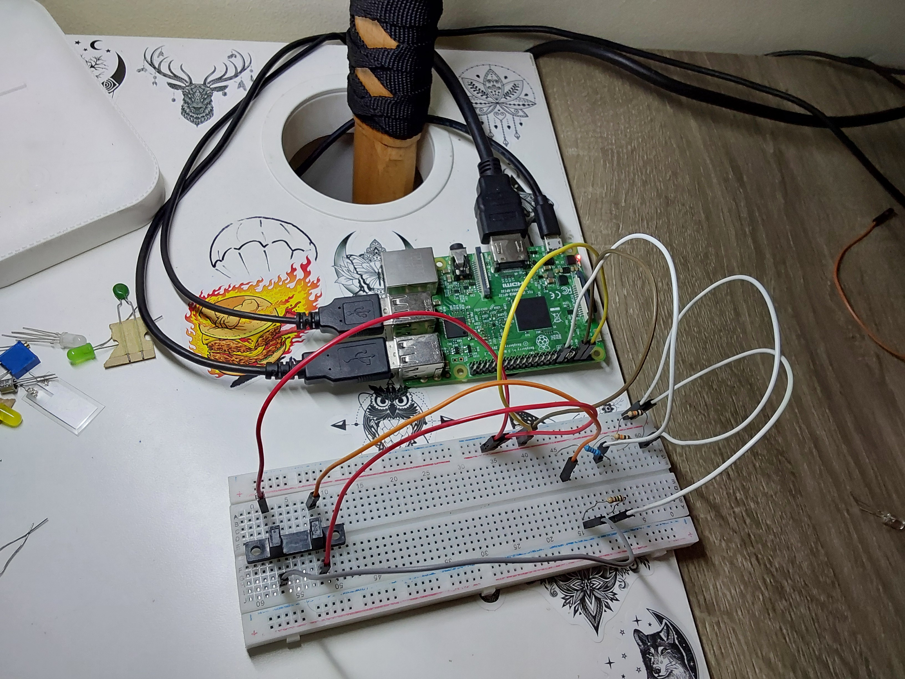

# P4-Encoder

## Objetivos de la práctica

Los objetivos propuestos para esta práctica serían los siguientes:
- Obtener la velocidad angular (en rpm) del encoder incremental que construiremos mediante un optointerruptor y un disco con muescas que fabricaremos de forma casera
- Leer el tren de pulsos emitido por el sensor óptico y, haciendo uso de interrupciones, sensar cuándo se produce un cambio en el pin al que conectemos el optointerruptor
- Siguiendo el esquema de terminales del interruptor expuesto en la hoja de especificaciones adjunta, identificar el lado del diodo emisor y el lado del transistor, ası́ como diseñar el circuito
- Ofrecer esa funcionalidad bajo los detalles e intstrucciones detallados en el documento [practica.pdf](practica.pdf)

## Circuito
### Imagen del Circuito
<p align="center">
  
  
</p>

Se han empleado los siguientes elementos en el desarrollo y conexión del circuito:
- 1 optointerruptor
- 3 resistencias de 10k ohmios (utilizadas en un circuito divisor de voltaje)
- 1 resistencia de 150 ohmios

El circuito divisor de voltaje fue desarrollado con dos resistencias en serie de 10k ohmios, haciendo un total de 20k ohmios en dicha línea, puestas en paralelo con la tercera resistencia 10k, tal como se puede observar en las imágenes superiores

## Código Desarrollado

### **[encoder](scripts/encoder.py)**

Pese a un mal funcionamiento del optointerruptor, se ha logrado simular el cambio de medición del pin GPIO que se encargaría de registrar los valores devueltos por el *emitter* del optointerruptor.

El sensor haría que se registrase en entrada por el pin GPIO un 1 en caso de pasar el haz de luz infrarroja por la rendija de una rueda con muescas, y 0 en caso contrario (el haz está siendo ocluído por una muesca de la misma). Tras simular este comportamiento pulsando con un cable conectado a voltaje en la parte correcta de la protoboard, el código se comportaría de la manera habitual con el sensor. 

Dada la práctica 3 desarrollada previamente, se ha implementado en esta un mecanismo de los trabajados en la misma, el *wait for edge*. El control de conteo de pulsos se realiza en el programa principal, así como paralelamente se ejecuta un *timer* en otro hilo. Cuando pasan 10 segundos, se ejecuta la función adjunta a dicho temporizador y termina el programa. Esto permite que con un muestreo de 1/6 de minuto podamos ver las rpm a las que gira la rueda con muescas utilizada, o en nuestro caso, la simulación por pulsaciones rápidas de la misma.

El control principal únicamente se realiza mientras que la variable **ejecutando** se establezca como verdadera:

```python
while ejecutando:
    # en caso de detectar un cambio de 0 a 1, sumamos una iteracion (ha pasado una muesca)
    lectura = GPIO.wait_for_edge(PIN_OPTO, GPIO.RISING)
    if lectura: iteraciones += 1
```

Al terminar el temporizador que permite el conteo de pulsos, se ejecutaría una función que cambia el valor de dicha variable para poder finalizar el programa sin ningún tipo de complicación adicional. Podemos ver la función que ejecuta el *threading timer* a continuación:
```python
def calculo_por_lectura():
	vueltas = iteraciones / ITS_POR_VUELTA
	rmp 	= 6 * vueltas # n vueltas en 60 seg dada la muestra de 10 seg
	
	# imprimimos la informacion de iteraciones, vueltas y rmp calculada
	print("--[INFO MOTOR]--------------")
	print("-[%.1f] iteraciones" % iteraciones)
	print("-[%.1f] vueltas / 10s" % vueltas)
	print("-[%.1f] rmp" % rmp)
	
	global ejecutando
	ejecutando = False
	return ejecutando
```

## Solución Final

A continuacion queda un video de la solución explicada previamente en funcionamiento

> [encoder](https://drive.google.com/file/d/1LR42EjSEftoE4zOVoOBx-DCye6kJWX08/view?usp=sharing)

Además, dejo también un vídeo en el que se muestra el mal funcionamiento del optointerruptor

> [fallosOptointerruptor](https://drive.google.com/file/d/1LNp6jOchmjSxE7O81E2g0lRW_cP6q9Pr/view?usp=sharing)

## Autoría

Práctica llevada a cabo por el estudiante:

* **Moisés Muñoz Suárez** - [mmunozs2020](https://github.com/mmunozs2020)

---
