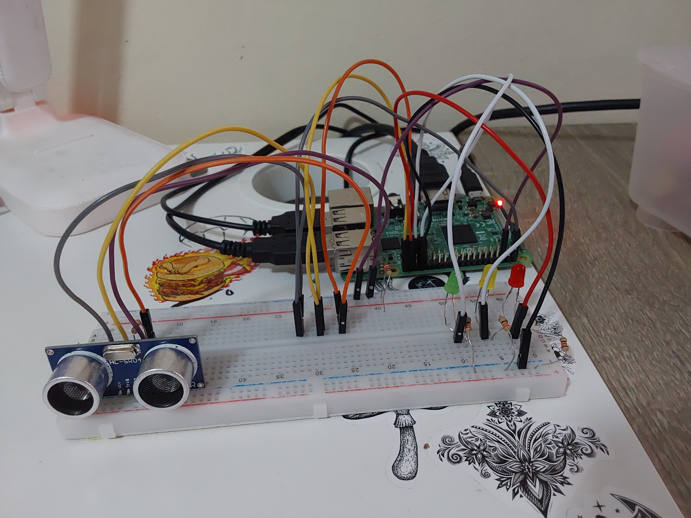
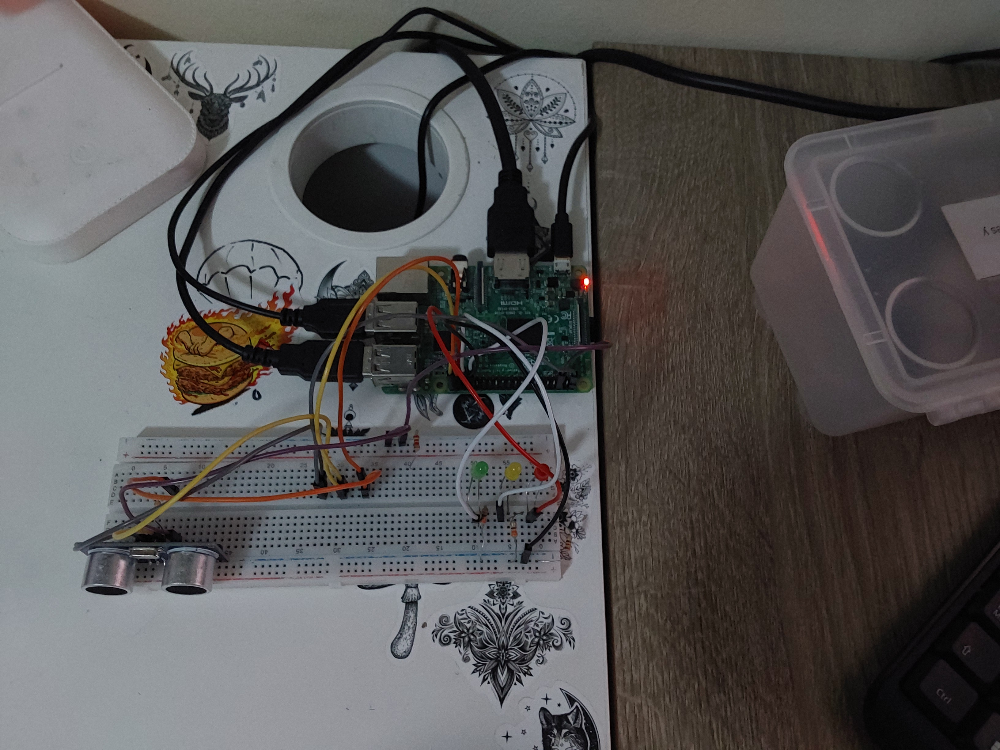

# P5-US

## Objetivos de la práctica

Los objetivos propuestos para esta práctica serían los siguientes:
- Adaptar el código anterior para que el interfaz sea más amigable. Para ello, haciendo uso de tres LEDs que indiquen el acercamiento del objeto según cierto criterio propio
    * 1. Luz verde. Inicialmente, será el LED que estará encendido, indicando que existe una distancia de seguridad razonable al objeto
    * 2. Luz amarilla. Si el objeto entra en un tramo intermedio de distancia, que consideremos prudencial, aunque no crı́tica.
    * 3. Luz roja. Si el objeto entra en una zona peligrosa de distancia; esto es, está excesivamente cerca.
- Ofrecer esa funcionalidad bajo los detalles e instrucciones detallados en el documento [practica.pdf](practica.pdf)

## Circuito
### Imagen del Circuito
<p align="center">
  
  
</p>

Se han empleado los siguientes elementos en el desarrollo y conexión del circuito:
- 1 led verde
- 1 led amarillo
- 1 led rojo
- 3 resistencias de 330 ohmios
- 1 resistencia de 1k ohmios
- 1 resistencia de 2,2k ohmios
- 1 sensor de ultrasonidos HC-SR04

## Código Desarrollado

### **[ultrasonidos](scripts/ultrasonidos.py)**

Partiendo del código que se nos proporcionaba con las especificaciones a realizar, se ha llegado a la solución siguiente:

Se ha implementado una breve interfaz con el usuario para solicitar una distancia de seguridad, que será el márgen para el encendido del led rojo, es decir, el indicador de peligro. Por otro lado, la distancia intermedia es calculada como el doble de la distancia de peligro establecida.

Teniendo eso en mente, ahora podemos pasar al control del sensor de ultrasonidos. Para este programa, la distancia es medida constantemente en el bucle principal, iterando con un descanso de medio segundo. Para cada medición realizada, llama a una función que se encarga del control de las luces, manteniendo encendida siempre la correspondiente con respecto a la distancia de seguridad.

El código del bucle principal encargado de medir distancias queda muy simple de esta manera, haciéndolo fácil de entender y modificar en caso de que fuera necesario:

```python
while True:
    distancia_medida = leer_distancia()
    control_led(distancia_medida)
    print("Distancia: ", distancia_medida, " cm")
    
    time.sleep(0.5)
```

Por otra parte, la funcion **control_led** que se encarga del encendido de la luz correspondiente, a su misma vez, llama según el valor de la lectura que recibe, a una función que enciende únicamente el led especificado y se asegura de que el resto estén apagados, lo estuvieran antes o no.

```python
def control_led(dist):
      if(dist < distancia_peligro):
            encender_1_led(PIN_ROJO)
      elif(dist < distancia_cautela):
            encender_1_led(PIN_AMARILLO)
      else:
            encender_1_led(PIN_VERDE)
```

## Solución Final

A continuacion queda un video de la solución explicada previamente en funcionamiento

> [ultrasonidos](https://drive.google.com/file/d/1IPotP9PrHwm8cx1fOubgAAUkiY44SnEZ/view?usp=sharing)

## Autoría

Práctica llevada a cabo por el estudiante:

* **Moisés Muñoz Suárez** - [mmunozs2020](https://github.com/mmunozs2020)

---
