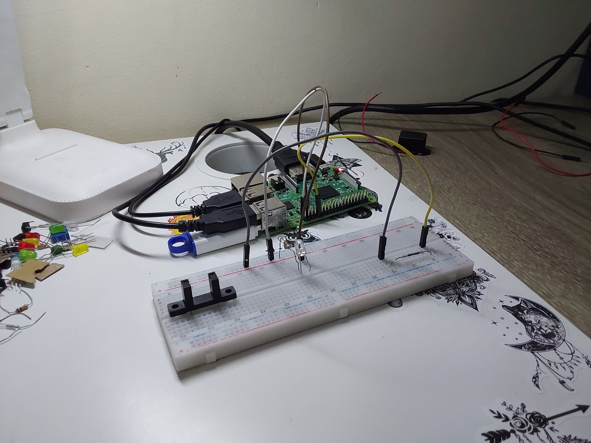
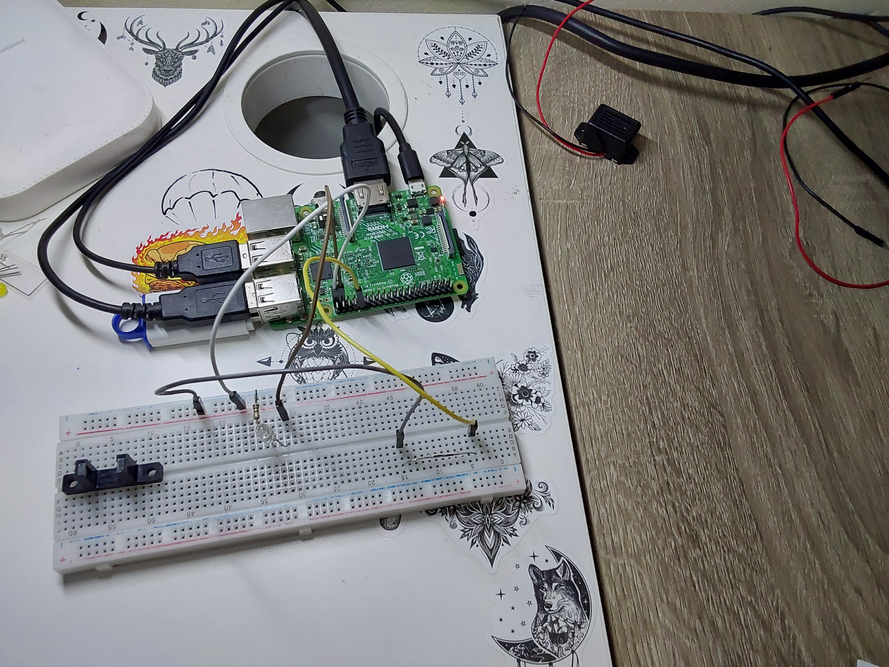

[](https://classroom.github.com/a/pz9Q4_lW)
# P6-ReedSwitch

## Objetivos de la práctica

Los objetivos propuestos para esta práctica serían los siguientes:
- Construir el circuito para que se pueda conocer el estado del interruptor en todo momento, tenga cerca un imán o no (lo que simulará puerta abierta/cerrada)
- Una vez asegurado que se está recibiendo el estado coherentemente, añadir al circuito un LED que refleje dicho estado
- Ofrecer esa funcionalidad bajo los detalles e instrucciones detallados en el documento [practica.pdf](practica.pdf)

## Circuito
### Imagen del Circuito
<p align="center">
  
  
</p>

Se han empleado los siguientes elementos en el desarrollo y conexión del circuito:
- 1 led blanco
- 1 resistencia de 330 ohmios
- 1 *reedswitch*

## Código Desarrollado

### **[reedswitch](scripts/reedswitch.py)**

Para la realización de este programa se ha empleado, igual que en ejercicios anteriores, una estructura muy simplificada en el bucle principal del programa, con llamadas a funciones que dividen y se encargan del control de partes concretas del programa.

En este caso el bucle principal, a intervalos de 1/20 de segundo, lee el estado devuelto por el reedswitch, y mantiene un control por lectura idéntico al que se desarrolló para la práctica del sensor de ultrasonidos. Sin embargo, a diferencia del control desarrollado para la práctica anterior, este presenta dos elementos que le permiten funcionar correctamente: la lectura del sensor y un contador de iteraciones:

```python
while True:
    lectura = GPIO.input(PIN_REEDSWITCH)
    
    iteraciones = control_por_lectura(lectura, iteraciones)
    signal.signal(signal.SIGINT, callbackSalir) # callback para CTRL+C
    
    time.sleep(0.05)
```

Este contador es inicializado a cero fuera del bucle, tras el setup inicial, y tiene la función de evitar oscilaciones indeseadas en la lectura del sensor. 

Al comienzo del desarrollo de la práctica se observó que únicamente con un control por lectura, el reedswitch daba problemas, ya que al no haber ningún elemento imantado cerca oscilaba en sus lecturas, dando ambos valores 0 y 1 oscilando irregularmente. Sin embargo, dado que el valor que queríamos evitar era ese 1, se añadió dicho contador de iteraciones, y, tras ser ajustado con varias pruebas, se estableció su límite óptimmo en 15 como máximo.

Esto significa que en caso de detectarse una lectura a 1 (posible iman cercano al sensor), se contaría hasta 15 iteraciones antes de encender el led de seguridad, para asegurarnos de que realmente se desea cambiar el estado del led, y que no son variaciones o "ruido" indeseados.

La comprobación de la lectura e iteraciones para encendido y apagado del led la realiza la función que vimos previamente denominada **control_por_lectura**. A continuación queda su definición:

```python
# controla el estado del led según la lectura recibida y el numero de iteraciones
def control_por_lectura(lectura, iteraciones):
	if not lectura:
		if iteraciones < 15:
			iteraciones += 1
		else:
			encender_apagar_led(PIN_LED, ENCENDER)
	else:
		iteraciones = 0
		encender_apagar_led(PIN_LED, APAGAR)
		
	return iteraciones
```

## Solución Final

A continuacion queda un video de la solución explicada previamente en funcionamiento

> [reedswitch](https://drive.google.com/file/d/1LIqugDr4aHc2mRQ3pmBY6OCE6VsKxDA6/view?usp=sharing)

## Autoría

Práctica llevada a cabo por el estudiante:

* **Moisés Muñoz Suárez** - [mmunozs2020](https://github.com/mmunozs2020)

---
