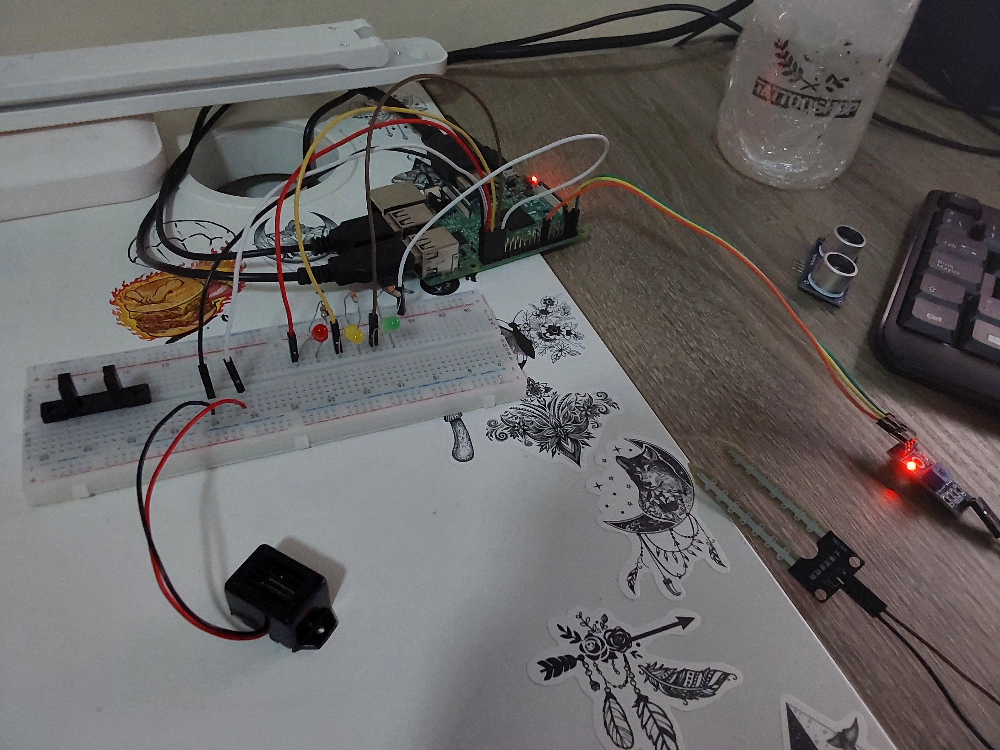
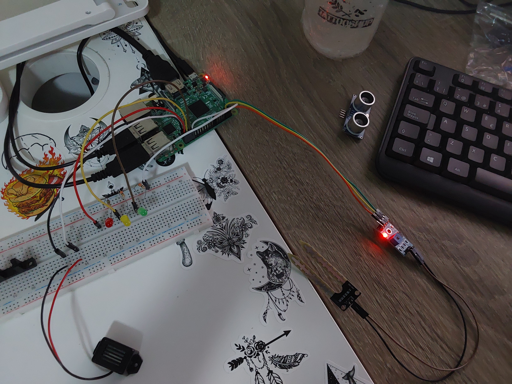

[](https://classroom.github.com/a/bOanB5Fv)
# P7-Humedad

## Objetivos de la práctica

Los objetivos propuestos para esta práctica serían los siguientes:
- Desarrollar un programa para leer los valores del módulo FC-28
- Ajustar la regulación del módulo M393 convenientemente para detectar cuándo una planta tiene la suficiente humedad y/o cuándo necesita ser regada (a falta de una planta se ha utilizado un papel mojado)
- Hacer un interfaz ameno e intuitivo para que una persona ajena al mundo de la programación pueda emplear tu programa para alertar de la falta de riego de una planta
- Añadir otras posibles implementaciones o *features* para complementar y completar las distintas funcionalidades del programa
- Ofrecer esa funcionalidad bajo los detalles e instrucciones detallados en el documento [practica.pdf](practica.pdf)

## Circuito
### Imagen del Circuito
<p align="center">
  
  
</p>

Se han empleado los siguientes elementos en el desarrollo y conexión del circuito:
- 1 led verde
- 1 led amarillo
- 1 led rojo
- 1 zumbador
- 3 resistencias de 330 ohmios
- 1 sensor M393
- 1 sensor de humedad

## Código Desarrollado

### **[humedad](scripts/humedad.py)**

Este programa ha sido enfocado como una máquina de estados, con un temporizador que, cambiando su valor límite, serviría para ajustar el tiempo de cambio de estados para cuando no se detecta humedad en una planta.

La funcionalidad básica del programa se ha desarrollado en varias funciones, utilizando como habitualmente en ejercicios previos una función clave para el control por lectura. En este caso dicha función tomará tres valores: la lectura como tal del sensor de humedad (en digital), un contador de iteraciones ajustado para una cuenta atrás de poco más de 5 segundos cuya utilidad se detalla más adelante, y una variable *status* que determina el estado actual del programa.

```python
# -> funcion "master": control principal que actua según la humedad
def control_por_lectura(lectura, counter, status):
    if(lectura == 0):
        counter, status = do_humedad_alta(counter, status)
    elif(lectura == 1):
        counter, status = do_humedad_baja(counter, status)
    return counter, status
```

Esta función es llamada en el bucle principal, y devuelve el contador de iteraciones y el estado para evitar errores al actualizar las variables que los controlan. Estas variables se han puesto por los siguientes motivos y funcionamientos:

1. **counter:** como se menciona previamente, es un contador de iteraciones, que sabemos que llega hasta algo más de 5 segundos por la espera que realiza el bucle principal del programa en cada iteración, de 0.1 segundos. Al llegar a 0 este contador de iteraciones, se cambia el estado a uno inmediatamente inferior. Con cada cambio de estado, esta variable vuelve a su valor original
2. **status:** esta variable almacena el estado actual del programa, de entre los posibles que se la han definido, siendo 4 en total. Según el valor de estado actual, el programa determina qué comportamiento debe adoptar.

Los estados del programa son los siguientes:

```python
# estados por los que pasa el programa en humedad baja segun el tiempo
VERDE       = 3
AMARILLO    = 2
ROJO        = 1
GRITOS      = 0
```

- *VERDE:* indica que la planta, o el elemento que fuere, tiene la humedad suficiente según el ajuste del módulo M393 realizado. Mantiene el led verde encendido. Mientras se detecte humedad por el sensor, este estado permanece intacto y no se activa el contador. En cuanto se deja de detectar la humedad suficiente, se activa el contador con la variable *counter* explicada previamente, y al llegar a cero se pasa al estado inferior.
- *AMARILLO:* indica que la planta lleva algo de tiempo sin recibir agua. Este estado restablece el contador y vuelve a iniciar la cuenta regresiva de iteraciones, de modo que cuando llega a 0, así como el estado VERDE previo, cambia al estado inferior. Mantiene el led amarillo encendido (y apagados el resto).
- *ROJO:* indica que la planta ya lleva bastante tiempo sin haber sido regada, y con ello hace demasiado tiempo que no se detecta humedad. De nuevo, este estado reinicia el contador y al llegar a cero pasa al inferior. Mantiene el led rojo encendido (y apagados el resto)
- *GRITOS:* este estado es algo molesto, pero es un buen recordatorio para regar una planta. El contador deja de tomar importancia y ya no se reduce más el estado. En este nivel se activa el zumbador para emitir ruido, mientras se mantiene el aviso visual del led rojo encendido. Este estado permanece hasta que se vuelva a detectar humedad.

En cualquier estado distinto a VERDE, si se detecta de repente una medición de humedad correcta, se restablece el estado y el contador se reinicia, volviendo al comienzo (*status = VERDE, counter = 50*)

El último estado, GRITOS, por necesitar una variable adicional para el control del zumbador, se ha establecido fuera del control de cualquier función, estando en el bucle principal del programa, tras la llamada al control por lectura, tal y como podemos observar a continuación:

```python
while True:
    lectura = GPIO.input(PIN_HUMEDAD)
    
    c, s = control_por_lectura(lectura, c, s)
    if(s == GRITOS):
        pwm.ChangeDutyCycle(100) 
        time.sleep(0.1)
        pwm.ChangeDutyCycle(0)
        print("ME DESHIDRATOOOO AAAAAAAAAAAAAAAAAHHHHH!!!")
    
    time.sleep(0.1)
    signal.signal(signal.SIGINT, callbackSalir) # callback para CTRL+C
```

Además de las acciones correspondientes visuales por los leds y/o auditivas que toma cada estado, se han mantenido ciertas trazas para tener un aviso adicional para el usuario desde la pantalla del dispositivo al que se encuentre conectada la raspberry (o cualquier otro controlador que se quiera utilizar). La única repetida por cada iteración y no por cambio de estado es la que observamos arriba en el código del bucle principal. 

## Solución Final

A continuacion queda un video de la solución explicada previamente en funcionamiento

> [humedad](https://drive.google.com/file/d/1JwibF5ajn6abybrSmhlCpEFAQ7D2Unps/view?usp=sharing)

## Autoría

Práctica llevada a cabo por el estudiante:

* **Moisés Muñoz Suárez** - [mmunozs2020](https://github.com/mmunozs2020)

---
