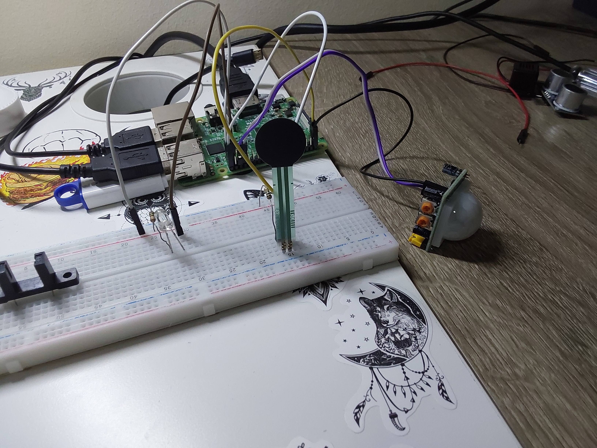
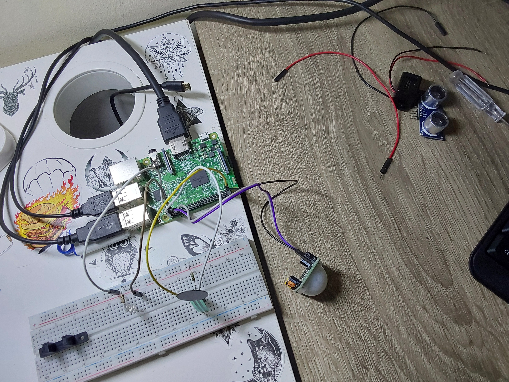

[](https://classroom.github.com/a/7u4owJ1l)
# P8-Fuerza

## Objetivos de la práctica

Los objetivos propuestos para esta práctica serían los siguientes:
- Implementar dos códigos, uno para la lectura del sensor de presencia (llamado presencia.py), y otro para el sensor de presión (llamado fuerza.py)
- Diseñar un sistema de iluminación inteligente cuyo objetivo práctico fuera -como idea- iluminar el jardín de una casa solo cuando haya paso de personas, no de animales
- Usar el sensor de presión a modo de botón, y solo cuando este se haya presionado (por un humano, se entiende), se activará el detector de presencia durante un tiempo prudencial. Si en ese tiempo se detecta presencia, se deberá encender un LED de cortesía, igualmente durante un tiempo determinado
- Ofrecer esa funcionalidad bajo los detalles e instrucciones detallados en el documento [practica.pdf](practica.pdf)

## Circuito
### Imagen del Circuito
<p align="center">
  
  
</p>

Se han empleado los siguientes elementos en el desarrollo y conexión del circuito:
- 1 led blanco
- 1 resistencia de 330 ohmios
- 1 resistencia de 1M de ohmios
- 1 sensor de presencia HC-SR501
- 1 sensor de presión FSR

## Código Desarrollado

### **[fuerza](scripts/fuerza.py)**

Este código es realmente simple, hecho únicamente como base para probar, demostrar y calibrar el funcionamiento del sensor de presión. Tomando como base el código desarrollado para el sensor de humedad, y siendo habitual en prácticas previas, se ha diseñado un control por lectura, que es realizado por una función que porta ese mismo nombre

```python
# -> funcion "master": control principal que actua según la presion 
def control_por_lectura(lectura, iteraciones):
    if(lectura == 1):
        if(iteraciones > 20):
            do_presion_detectada()
    elif(lectura == 0):
        do_presion_cero()
```

Ya ocurrió con el *reedswitch* la oscilación de las lecturas a la hora de leer del pin que conectaba con dicho sensor, y de igual manera, tras varias pruebas, se vio que ocurría lo mismo con este sensor. La solución tomada es la misma que se llevó a cabo en el proyecto del reedswitch. Un contador de iteraciones se ajusta a un máximo para que las oscilaciones no afecten al estado del programa en ningún momento. En este caso el límite establecido como óptimo ha sido 20.

### **[presencia](scripts/presencia.py)**

Este código, así como el anterior es muy simple, realizado únicamente como base para el testeo, calibrado del funcionamiento del sensor de presión. De igual manera que el anterior código, toma como base el control por lectura implementado en una función con dicho nombre. En cambio, este programa no necesita de conteo de iteraciones, funciona únicamente siguiendo la lectura detectada ya que esta no presenta oscilaciones ni comportamientos inusuales.

```python
# -> funcion "master": control principal que actua según la lectura de presencia 
def control_por_lectura(lectura):
    if(lectura == 1):
        do_presencia_detectada()
    elif(lectura == 0):
        do_presencia_cero()
```

En caso de detectarse una presencia, se encenderá el led, y mientras no se detecte, permanecerá apagado. Como implementación nueva, esta vez no se itera todo el rato comprobando la lectura. En este caso el bucle principal funciona por detección de eventos. De esta manera, cuando la lectura cambia, ya sea de 1 a 0 o al contrario, se llama a la función que hemos visto previamente para que actualice sólo entonces el estado del led como corresponda:

```python
if GPIO.event_detected(PIN_PRESENCIA):
    lectura = GPIO.input(PIN_PRESENCIA)
    control_por_lectura(lectura)
```

### **[iluminacionInteligente](scripts/iluminacionInteligente.py)**

Este programa combina las funcionalidades de los dos previos tal como se indica en los objetivos, simulando el comportamiento de un sensor para exteriores en una casa, controlado previamente por la pulsación de un botón, en nuestro caso, un sensor de presión.

El programa en su bucle de ejecución principal funciona con un control doble, uno que se encarga de comprobar, actualizando las iteraciones cuando corresponda, la lectura del sensor de presión, y otro que se encarga de ver si está activo el control de presencia. 

```python
while True:
    ctime = time.time()
    # si detectamos presion, activamos la deteccion de presencia por
    # 30 segundos desde que ha sido pulsado
    presion_detectada, iters_presion = control_presion(iters_presion)
    if presion_detectada:
        timer_presencia = ctime + 30
    
    # si la deteccion de presencia está activa por tiempo, se
    # establecen los valores de accion y timer led que correspondan
    if timer_presencia >= ctime:
        accion_led, timer_led = control_presencia(accion_led, timer_led)
    
    # segun los valores de accion y timer led, se enciende o apaga
    # este mismo
    control_led(accion_led, timer_led)
```

Este tramo de programa principal funciona tal como vemos en los comentarios que presenta. Analizándolo más en detalle, las dos funciones destacables,**control_presion** y **control_presencia**, tienen el siguiente funcionamiento

1. **control_presion:** esta función recibe como parametro una variable que contea las iteraciones en las que se ha detectado un pulso alto (pulsacion en el sensor u oscilación del valor del mismo). En caso de detectarse un valor alto durante suficientes iteraciones, se cambia el valor de la variable que permite activarse al control de presencia, y se devuelve al bucle principal, ya que es allí donde se comprueba:

```python
# controla cuando se detecta como activo el sensor de presion
# con una comprobacion doble por iteraciones dado su mal funcionamiento
def control_presion(iteraciones):
    presion_detectada = False
    
    if(GPIO.input(PIN_PRESION) == 1):
        if(iteraciones < 20):
            iteraciones += 1
        else:
            presion_detectada = True
    else:
        iteraciones = 0
    
    return presion_detectada, iteraciones
```

2. **control_presencia:** si volvemos a mirar el código del bucle principal del programa podemos ver que esta función solo es llamada en caso de que se haya establecido un timer a un momento posterior al actual. Esto se realiza con la variable *presion_detectada* que devuelve la función anterior. Ahora bien, cuando se llama a esta función, similar a como se realiza en el código de [presencia.py](scripts/presencia.py), se comprueba la detección de evento y el valor de la lectura (para evitar rebotes o errores cuando se pase de detectar presencia a no hacerlo). En caso de que se detecte una presencia, esta función devuelve también una variable que, en el código principal, establece la acción y el temporizador necesarios para encender el led el tiempo que sea.

```python
# en caso de detectar presencia, establece un temporizador para encender
# el led 10 segundos tras haberse detectado
def control_presencia(accion_led, timer_led):
    if(GPIO.event_detected(PIN_PRESENCIA) and GPIO.input(PIN_PRESENCIA) == 1):
        accion_led = ENCENDER
        timer_led = time.time() + 10
        
    return accion_led, timer_led
```

Esto se traduce en un comportamiento del programa que hace posible que, al pulsarse el sensor de presión, se pase a detectar presencia por 30 segundos (según el límite de tiempo establecido). En ese estado, en caso de detectarse una presencia, se pasa a encender el led con un temporizador también. Además, el programa hace que durante esos 30 segundos activos, el sensor de presencia pueda restablecer el temporizador del led si vuelve a detectar algo, para que no esté apagando y encendiendo la luz mientras el movimiento permanezca.

## Solución Final

A continuacion queda un video de cada solución previa explicada en funcionamiento

> [fuerza](https://drive.google.com/file/d/1KN-8L41-e7vqpd9uimM2g7MgitteQc-h/view?usp=sharing)

> [presencia](https://drive.google.com/file/d/1KRLm3CpjQ3swSty2EnPKMbzwFMU-fRko/view?usp=sharing)

> [iluminacionInteligente](https://drive.google.com/file/d/1Kf-BjD_kWkFcze50DKsAeDdm96UR6_O2/view?usp=sharing)

## Autoría

Práctica llevada a cabo por el estudiante:

* **Moisés Muñoz Suárez** - [mmunozs2020](https://github.com/mmunozs2020)

---
