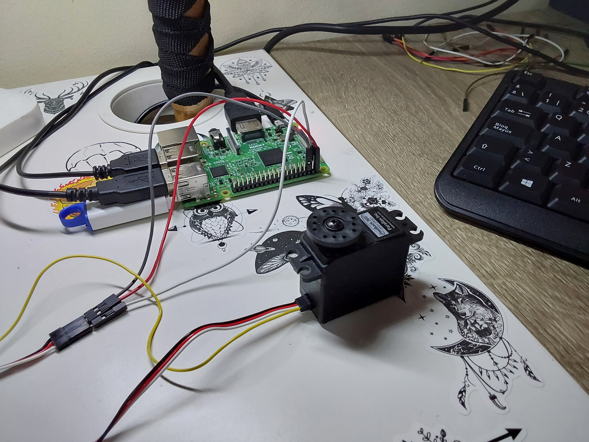
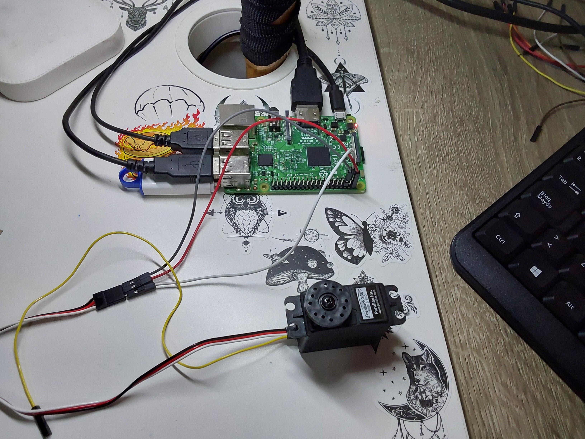

# P9-Servo_23-24

## Objetivos de la práctica

Los objetivos propuestos para esta práctica serían los siguientes:
- Encontrar los valores para hacer girar el servomotor en ambos sentidos a distintas velocidades
- Incorporar esas distintas velocidades como comandos a leer por teclado
- Partiendo de lo conseguido en el ejercicio anterior, en este caso se pide encontrar la ecuación lineal que permita asociar una velocidad (en m/s) a un comando de ciclo de trabajo que efectúa tal velocidad
- Ofrecer esa funcionalidad bajo los detalles e instrucciones detallados en el documento [practica.pdf](practica.pdf)

## Circuito
### Imagen del Circuito
<p align="center">
  
  
</p>

Se han empleado los siguientes elementos en el desarrollo y conexión del circuito:
- 1 Modelo Feedback 360 High Speed Servo de Parallax

## Código Desarrollado

### **[servoMarchas](scripts/servoMarchas.py)**

Este código presenta una estructura aún más simple que muchas prácticas previas en su bucle principal, constando únicamente de una línea encargada de recibir la orden dada por el teclado por parte del usuario, y otra encargada de ejecutar una función que realiza el control del comportamiento según dicha orden. En el código proporcionado de ejemplo la estructura era distinta y ha sido modificada para una mejor legibilidad del mismo y para unificar las distintas partes de su comportamiento de forma más limpia.

```python
# Recibe la direccion previa y una marcha nueva. Cambia la marcha
def control_por_orden(orden, midir, mimar):
  ndir, nmar = midir, mimar
  
  if orden in "wsx":
    ndir, nmar = control_motor(orden, mimar)
    
  elif orden in "012345":
    ndir, nmar = control_motor(midir, int(orden))
    
  return ndir, nmar
```

Esta función de control por orden recibe la propia orden, junto a la dirección y marcha actuales del servomotor. En caso de que la orden sea de cambio de direccion, se llamará a la función que controla más internamente los cambios del motor empleando la dirección nueva y la marcha actual. Por otra parte, si la orden es de cambio de marcha, se llamará a esa misma función utilizando la dirección actual y la marcha nueva. Esta función retorna la marcha y dirección finales (tras el cambio según la orden) para almacenarlas en el bucle principal

Si miramos la función de **control_motor** que aparece arriba, vemos que establece el motor a cierta dirección y marcha sin importar cuál sea nueva. Esto significa que si quisiéramos implementar reconocimientos de órdenes nuevas para cambiar dirección y marcha simultáneamente, seguiría siendo posible. Al llamar a esta función con un valor de los actuales, sea dirección o marcha, logramos que este se establezca nuevamente, haciendo de esta manera, que el estado del motor no cambie en dicho aspecto.

```python
# Recibe direccion y marcha y establece el movimiento y velocidad debidos
def control_motor(direccion, marcha):
  if direccion == ADELANTE:
    adelante(marcha)
    
  elif direccion == ATRAS:
    atras(marcha)
  
  elif direccion == PARADA:
    marcha = 1
    parar()
  
  return direccion, marcha
```

Como dichas modificaciones requerían cambiar el modo y lugar en que se llamaba a la función de parada (que detenía totalmente el programa), se han añadido dos funcionamientos de interés para hacer este código más dinámico para pruebas. 

1. Entre las posibles órdenes vemos que hay una marcha 0, y es esta la encargada de detener el motor, comandando la velocidad de giro adecuada, manteniendo una dirección y permitiendo cambiarla estando el giro detenido. 
2. Ahora, el bucle principal del programa ejecuta siguiendo el valor de una variable llamada *motor_on*. En la función parada, esta variable se establece al valor que hace que el bucle deje de ejecutar, logrando así una terminación limpia del programa que no es posible si no añadimos estos cambios.

### **[servoVelocidades](scripts/servoVelocidades.py)**

Este código es prácticamente idéntico al anterior, incluyendo únicamente unos breves cambios que hacen posible la implementación de velocidades lineales ficticias. Las órdenes de dirección y marcha se mantienen, añadiendo ahora la impresión por pantalla de información relativa a la velocidad lineal de movimiento que llevaría el motor según la última orden comandada, es decir, el estado en el que se encuentra.

```python
# gira en un sentido a la velocidad determinada por la marcha que recibe
def adelante (marcha):
  v_lineal = MIN_V_LINEAL + INCREMENTO_VL * (marcha - 1)
  velocidad = 1520 + 40 * marcha
  print("> [%.2f m/s] | [w][%.d] --adelante-->" % (v_lineal, marcha))
  miServo.set_servo_pulsewidth(PIN_SERVO, velocidad)
```

El cáculo de la velocidad impresa se realiza tomando una base de velocidad lineal a la que se suma un incremento fijo dado por cada marcha. Por cada marcha que se escale, la velocidad lineal aumenta de forma directamente proporcional en 0.5m/s. Estos valores no son aplicables al mundo real ni han sido tomados de experimentación o mediciones precisas. Son un mero ejemplo del funcionamiento escalado de los incrementos de velocidad, con realimentación para el usuario en forma de valores estandarizados. De esta forma logramos una interfaz que permite comprender de manera más visible la correspondencia que habría entre cambios de marcha en dicho motor y la velocidad final alcanzada.

```python
MIN_V_LINEAL      = 0.5 # totalmente real, medida con cosas para medir cosas
INCREMENTO_VL     = 0.5 # +0.5m/s por marcha superior
```

El funcionamiento del motor en los vídeos que encontramos abajo es el mismo en ambos casos, sin embargo, en uno se muestra la información que imprime por pantalla el programa conforme cambiamos las órdenes. De igual manera, se ejemplifica que aunque comandemos velocidades u otras órdenes erróneas no cambia el comportamiento del motor ni ocurren cosas indeseadas.

## Solución Final

A continuacion queda un video de cada solución previa explicada en funcionamiento

> [servoMarchas](https://drive.google.com/file/d/1Ls8L3PWn90zTrvJs96LuQIocfP6bJXBs/view?usp=sharing)

> [servoVelocidades](https://drive.google.com/file/d/1LhErUhRQmIAoozyWOKbG4Bx-T9hYf7B2/view?usp=sharing)

## Autoría

Práctica llevada a cabo por el estudiante:

* **Moisés Muñoz Suárez** - [mmunozs2020](https://github.com/mmunozs2020)

---
